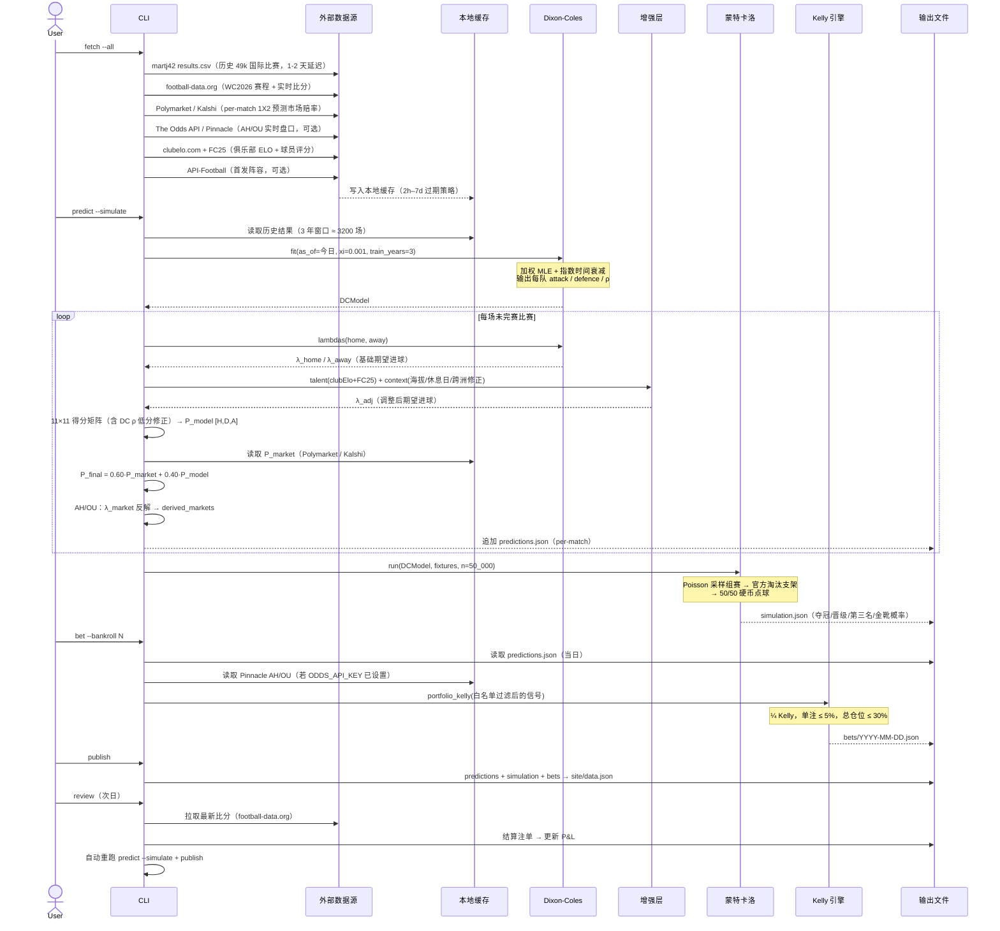

# worldcup-predictor 使用指南

本文档面向日常使用者，覆盖环境搭建、每日操作流程、下注建议的解读方式、
底层模型原理，以及所有 CLI 参数的完整说明。

---

## 1. 环境搭建

```bash
# 克隆仓库
git clone https://github.com/beersoccer/worldcup-predictor.git
cd worldcup-predictor

# 创建 Python 3.11 虚拟环境并激活
python3.11 -m venv .venv
source .venv/bin/activate          # Windows: .venv\Scripts\activate

# 安装依赖
pip install -r requirements.txt

# 配置 API 密钥（仅免费 key 是必须的）
cp .env.example .env
```

`.env` 中的关键字段：

| 变量 | 是否必须 | 说明 |
|---|---|---|
| `FOOTBALLDATA_KEY` | 必须（免费） | football-data.org 赛程/比分，注册即得 |
| `APIFOOTBALL_KEY` | 可选（免费） | API-Football 首发阵容，注册即得 |
| `ODDS_API_KEY` | 可选（免费档可用） | The Odds API，含 Pinnacle 盘口；免费档 500 credits/月，足够实时 AH/OU 报价（每次调用 ~2 credits，2h 本地缓存）|

**所有命令都需要** `PYTHONPATH=.` 前缀和激活的 venv。

---

## 2. 每日操作流程

**系统处理流程总览**



### 2.1 标准流程（比赛日）

```bash
# Step 1：赛前下午 — 拉取全量数据
source .venv/bin/activate
PYTHONPATH=. python -m skill.helpers.cli fetch --all

# Step 2：生成预测（含 50k 蒙特卡洛模拟）
PYTHONPATH=. python -m skill.helpers.cli predict --simulate

# Step 3：查看今日推荐下注（默认 1X2 胜负平，Run 31 验证最稳健）
PYTHONPATH=. python -m skill.helpers.cli bet --bankroll 1500

# Step 4（可选）：发布到本地看板
PYTHONPATH=. python -m skill.helpers.cli publish
python -m http.server 8780 --directory site   # 浏览器打开 http://localhost:8780

# Step 5：赛前 30 分钟再次更新（获取最新 Polymarket 价格 + 确认首发）
PYTHONPATH=. python -m skill.helpers.cli fetch --all
PYTHONPATH=. python -m skill.helpers.cli bet --bankroll 1500

# 跨时区提前准备：今晚提前为明日生成预测和下注建议
# --date 的作用：以 2026-06-23 为 DC 模型截止日（as_of），结果写入 reports/2026-06-23/
# predict 预测所有未完赛场次；bet --date 只从该目录取 date==2026-06-23 的比赛
PYTHONPATH=. python -m skill.helpers.cli predict --simulate --date 2026-06-23
PYTHONPATH=. python -m skill.helpers.cli bet --bankroll 1500 --date 2026-06-23
```

### 2.2 赛后结算（次日）

```bash
# 一条命令完成所有工作：回填结果 + 重预测 + 重发布看板
PYTHONPATH=. python -m skill.helpers.cli review
```

`review` 内部依次执行：拉取最新比分 → 结算已完赛注单 → 重新跑 `predict --simulate` → 重新跑 `publish`。**不需要**再单独执行 `predict` 或 `publish`。

---

## 3. bet 命令详解

### 3.1 基本语法

```bash
PYTHONPATH=. python -m skill.helpers.cli bet [选项]
```

| 参数 | 默认值 | 说明 |
|---|---|---|
| `--bankroll` | 10000 | 当前本金（任意单位，输出 stake 与之成比例） |
| `--mode` | `1x2` | 推荐市场，见下表 |
| `--date` | 今日 | 指定预测日期，格式 `YYYY-MM-DD` |
| `--edge` | 0.06 | 最低 edge 门槛，低于此不输出；可临时调低观察更多候选 |
| `--max-bets` | 无限制 | 设置后只输出 edge 最高的 N 条，不设则显示全部超过门槛的注单 |
| `--best-line` | 关闭 | 启用后每场每类市场只保留 edge 最高的一条（防相关嵌套下注），默认关闭 |

### 3.2 五种模式对比

| 模式 | 命令 | 输出 | 适用场景 |
|---|---|---|---|
| `1x2`（默认） | `bet --mode 1x2` | 胜平负 | 推荐日常使用（Run 31 实盘验证，命中率 56%，ROI +14.7%） |
| `ah` | `bet --mode ah` | 让球盘 3 条线 | 仅看让球盘 |
| `ou` | `bet --mode ou` | 大小盘 3 条线 | 仅看大小盘 |
| `ahou` | `bet --mode ahou` | 让球盘 + 大小盘各 3 条线 | 对齐主流亚洲盘口（赔率为模型公允价，非真实市场赔率） |
| `all` | `bet --mode all` | 1X2 + AH + OU 全部 | Kelly 在所有市场间统一分配仓位 |

**自动选线规则**（动态、按比赛而异）：

- **让球盘主线** = `round-to-half(-(λ_h - λ_a))`，再叠加 ±0.5 形成 3 条线
  - 例：FRA(λ=1.65) vs MAR(λ=0.88)，差 0.77 → 主线 -1.0，3 条线 = [-1.5, -1.0, -0.5]
- **大小盘主线** = `round-to-half(λ_h + λ_a)`，再叠加 ±0.5
  - 例：总进球 2.53 → 主线 2.5，3 条线 = [2.0, 2.5, 3.0]
- 让球盘范围 [-3, +3]，大小盘范围 [1.5, 4.5]，超出截断

### 3.3 输出解读

```
Bet                                                            p_win   odds    edge     stake
FRA vs MAR · AH -0.5 home                                     0.623   1.847   8.3%    415.00
FRA vs MAR · OU 2.5 under                                      0.541   2.100   6.1%    210.00

ARG vs MEX · AH +0.5 home                                     0.712   1.680   5.1%    195.00

─────────────────────────────────────────────────────────────────────────────────────────────
TOTAL                                                                                  820.00

logged → reports/bets/2026-06-20.json
```

各字段含义：

| 字段 | 含义 |
|---|---|
| `Bet` | 比赛 · 市场类型 · 方向（home/away/draw） |
| `p_win` | 模型估算的赢盘概率（DC + 上下文层 + 市场锚定） |
| `odds` | 市场隐含赔率（1 / 市场隐含概率，无佣金） |
| `edge` | 模型概率 − 市场隐含概率；≥ 6% 才会进入建议（默认，可用 `--edge` 覆盖，见 §5.1） |
| `stake` | 建议押注金额（按 1/4 Kelly 计算，已受单注 5% 上限约束） |

**排序规则：** 输出按场次分组，场次之间以空行分隔；场次按**该场最高 edge 降序**排列（最有价值的比赛在最前）；同场次内按 edge 降序排列。

**AH 方向解读：**

标签里的让球数（`+0.5` / `-0.5`）**始终加在主队**身上；`home` / `away` 只表示下注方向。

| 盘口 | 结算逻辑（`adjusted = margin + line`） | 赢盘条件 |
|---|---|---|
| `AH -0.5 home` | adjusted > 0 → margin > 0.5 → margin ≥ 1 | 主队赢至少 1 球 |
| `AH +0.5 home` | adjusted > 0 → margin > -0.5 → margin ≥ 0 | 主队赢或平 |
| `AH -0.5 away` | adjusted < 0 → margin < 0.5 → margin ≤ 0 | 客队赢或平（不输即可） |
| `AH +0.5 away` | adjusted < 0 → margin < -0.5 → margin ≤ -1 | 客队赢至少 1 球 |

注意：同号的 home/away 赢盘条件**相反**——`+0.5 home` 是不输，`+0.5 away` 反而是必须赢。

---

## 4. 底层模型原理

### 4.1 设计哲学：市场锚定的集成模型

**博彩公司的共识赔率长期来看很难被打败**——它聚合了全球聪明钱、内幕信息、
临场调整等所有公开和半公开信息。但**盲目复制赔率没有 edge**：照抄市场只能
拿到博彩公司收佣后的负期望。

本项目的设计是**市场锚定的集成（market-anchored ensemble）**：

1. **以去佣后的市场共识作为强先验**：Polymarket、Kalshi 多源平均归一
2. **叠加独立信号层**：Dixon-Coles 双变量泊松、ELO 强度先验、
   情境调整（海拔、休息日、伤病、跨洲强度差）
3. **混合输出**：`P_final = 0.60·P_market + 0.40·P_model_adj`
4. **关注分歧而非一致**：模型与市场**意见相同时**没有 edge，**意见相左时**
   才是值得下注的信号

这个哲学决定了所有下游设计：每个新因子必须在 walk-forward 上**独立打败基线**
才能进入模型；所有市场（1X2 / AH / OU 各线）必须通过 walk-forward 校准才能
进入下注白名单（见 §9）。

### 4.2 第一层：Dixon-Coles 期望进球

模型从 49,000+ 场历史国际比赛中拟合每支球队的**进攻力 α** 和**防守力 β**，
预测主客队各自的期望进球（λ_home、λ_away）：

```
λ_home = exp(α_home − β_away + home_advantage)
λ_away = exp(α_away − β_home)
```

加入 Dixon-Coles 低分修正（ρ 参数，避免 0-0/1-0/0-1/1-1 系统性低估），
和指数时间衰减（ξ=0.001，最近比赛权重更高）。训练窗口：截至预测日前 3 年。

有了 λ_home 和 λ_away，把每个可能的比分（0-0 到 10-10）的概率全部算出来，
组成一张 **11×11 的得分矩阵**，这是所有下游计算的基础。

### 4.3 第二层：强度调整

三个可选增强器，各以 10% 权重（`TALENT_WEIGHT`）叠入：

| 模块 | 数据源 | 说明 |
|---|---|---|
| `talent.py` | ClubElo.com | 俱乐部 ELO 均值 → 国家队进攻/防守强度 |
| `fcratings.py` | EA FC25 球员评分 | OVR + 攻防分项 → 强度先验 |
| `injuries.py` | `data/injuries_wc2026.json`（静态先验）+ API-Football `/injuries`（预测日实时拉取，自动合并） | 赛前缺阵球员从阵容移除后重算强度 |

**跨联合会修正**（Run 28）：UEFA/CONMEBOL 与其他联合会对阵时，
主流模型系统性低估强队优势 → 对强队 λ 乘以 `exp(+0.075)`（gap=0.15）。

### 4.4 第三层：比赛情境层

对 λ_home / λ_away 施加场景乘数：

| 因素 | 状态 | 说明 |
|---|---|---|
| 海拔 | ✅ 采用 | 主场海拔 >2000m → 客队 λ 下调 |
| 休息日差 | ✅ 采用（Run 12） | 多休 1 天 → 己方 λ +约 2% |
| 天气 | ❌ 拒绝（Run 19/20） | 1642 场回测无显著信号 |
| 其他 10 项 | ❌ 全部拒绝 | 重要性（Run 9）、死橡皮战意（Run 14）、卫冕冠军魔咒（Run 17）等均无信号 |

**"拒绝"的含义与再验证策略**

"拒绝"指在当时的数据量下 walk-forward 验证无稳定正贡献，该因素物理上不进入模型（不是赋权重为 0，而是代码里根本不存在）。这不是永久封杀：任何时候积累了新赛事样本，可以重新发起 walk-forward 实验；若新数据支持正贡献，写入 FINDINGS.md 并加回特征集。

### 4.5 第四层：市场锚定集成

```
P_final = 0.60 × P_market + 0.40 × P_model_adj
```

- `P_market`：Polymarket + Kalshi + The Odds API（若有 key）多源平均、去佣归一
- `P_model_adj`：DC + 强度 + 情境的综合模型概率
- 权重 `MARKET_WEIGHT=0.60` 经 Run 26 walk-forward 验证

### 4.6 让球盘 / 大小盘的 edge 来源（业界标准做法）

参考 Pinnacle 与学术文献，欧赔（1X2）转亚盘（AH/OU）的标准做法是
**反解市场隐含的进球期望 (λ_h^M, λ_a^M)**：

**步骤：**
1. 已知 DC 模型给出 `(λ_h^DC, λ_a^DC, ρ)` → 通过得分矩阵输出 1X2
2. **保持 ρ 不变**（ρ 是联赛级低分修正，不是单场参数），用 L-BFGS-B 反解
   `(λ_h^M, λ_a^M)`，使其经 DC 得分矩阵后输出**与市场 1X2 完全一致**
3. 用反解的市场 λ 通过同一套 `asian_handicap()` / `over_under()` 函数，
   计算**任意 AH/OU 线**的市场隐含概率
4. `edge = DC概率 − 市场λ概率`，所有线条统一比较

**优势：**
- 保留 DC 的 ρ 低分修正，不像粗暴的 Skellam 假设独立 Poisson
- 一次反解，所有 AH/OU 线（±0.5、±1、±1.5、±2、±2.5、OU 2/2.5/3/3.5/4）都可算 edge
- 与 Pinnacle 的"1X2 + AH + OU 内部一致定价"逻辑同源

**白名单约束（Run 27 + Run 30 验证）：**
- **OU 1.5**：Run 27 实证拒绝（Brier 劣于基线），硬封锁
- **OU 2.0**：Run 30 实证拒绝（Δ Brier +0.030，反技能），硬封锁——与 OU 1.5 同属 DC ρ 低分修正区，模型在此段系统性失准
- **AH −2.5 到 +2.5（含所有整数线）**：Run 30（2018-2024，n=419-574/线）全部 beat 基线，正式验证
- **OU 2.5 到 4.5**：Run 27 + Run 30 验证通过（OU 2.5 低置信度）
- **选线规则（`--best-line`，默认关闭）**：启用后每场每类市场（AH / OU 分别）只保留 edge 最高的一条线进入 Kelly 引擎，防止 AH -1.5 和 AH -2.5 等相关嵌套注单同时下注。使用 `bet --mode ahou --best-line` 开启

**术语说明：**

| 术语 | 含义 |
|---|---|
| **反技能（anti-skill）** | Brier score Δ Brier > 0，即模型预测比"什么都不做的历史胜率基线"更差——下注该线预期盈亏为负，加入模型反而损害精度 |
| **硬封锁（hard block）** | 在 `kelly.py::MARKET_WHITELIST` 中设为 `False`，`is_whitelisted()` 直接返回 False，Kelly 引擎跳过该市场，无论 edge 看起来多高都无法生成注单 |

硬封锁与 Run 14（死橡皮）、Run 17（卫冕魔咒）等因子拒绝用的是同一套机制：直觉上好看但 walk-forward 证伪的信号必须物理关闭，而不是靠"使用者自律"忽略。

### 4.7 罚点球：公平硬币（Run 29）

淘汰赛点球大战使用 **50/50 硬币**，不使用强度加权。
Walk-forward 在 231 场实际点球上证明：强度加权方案 Brier=0.2683，
硬币 Brier=0.2500，前者反技能。在可用样本量下无法恢复球队级点球技能。

### 4.8 蒙特卡洛锦标赛模拟（`skill/sim/montecarlo.py`）

**作用：把单场概率转化为锦标赛级结论。**

DC 模型为每场比赛输出 λ_home / λ_away，但"法国夺冠概率"这类问题涉及 7
轮淘汰赛的复合路径，理论枚举（48 队 × 7 轮 × 所有可能路径）在计算上不可行。
蒙特卡洛通过重复模拟解决这个问题：

| 阶段 | 模拟方法 |
|---|---|
| 小组赛（6 场 × 12 组） | 以 DC λ 做独立 Poisson 采样得到比分，计算积分/净胜球/总进球排名 |
| 第三名资格赛 | 回溯算法（backtracking）将 8 支最佳第三名分配到 8 个合法 R32 位置 |
| 淘汰赛 R32→决赛 | 按官方支架（`_R32/_R16_PAIRS/_QF_PAIRS/_SF_PAIRS`）Poisson 采样；平局时 50/50 硬币点球 |
| 三四名决赛 | 两支半决赛负者对阵，winner 计入 `reached["3rd"]` |

跑完 50,000 次后，每队的晋级/夺冠/第三名次数除以 50,000 即为概率。
这是 `simulation.json` 里所有锦标赛级数字的唯一来源。

**关键设计约束（Run 22 / Run 24 验证）：**
- 已打完的小组赛/淘汰赛比分在每次模拟中**钉死**，不重新采样——保证历史结果被正确吸收
- 第三名资格赛位置分配使用官方 2026 资格集（`_THIRD_ELIG`），同组不早于 QF 相遇

**Golden Boot（金靴奖）：** 每次模拟中，每场比赛的总进球数先由 Poisson 分配给两队，
再按球员得分份额（career_rate × 近期热门系数 × FC OVR × PK 能力）随机分配
给具体球员，累加 50k 次后输出 `p_winner`（以该总进球数赢得金靴的概率）。

### 4.9 训练数据与模型更新机制

**这不是预训练模型。** 每次运行 `predict` 时，DC 模型都从头用 L-BFGS-B
重新拟合，没有持久化权重文件。

| 维度 | 数值 | 说明 |
|---|---|---|
| 历史数据总量 | 49,520 场 | martj42 国际比赛结果，1872 年至今 |
| **实际训练窗口** | **≈ 3,200 场** | 最近 3 年（`train_years=3.0`），Run 10 验证优于 8 年窗口 |
| 时间衰减 | xi = 0.001 / 天 | 约 693 天半衰期；近期比赛权重更高 |
| 入选门槛 | ≥ 8 场历史记录 | 低于此数的队不参与当次拟合 |
| 拟合参数数量 | 2 × N_teams + 3 | attack / defence（N−1 自由参数）+ intercept / home_adv / ρ |

**更新路径（每日）：**

1. `fetch --all` 从 martj42 GitHub CSV 拉取最新结果（1-2 天延迟）
2. football-data.org 实时回填当日 WC2026 比分（零延迟）
3. `predict` 以**今日**为 `as_of` 截止重新拟合，自动吸收最新比赛结果

每次重新拟合约需 20-30 秒。这是"每比赛日必须重跑 `predict`"的根本原因——
不仅仅是因为市场赔率变了，还因为已打完比赛的强度估计也在实时更新。

---

## 5. 凯利公式与资金管理

### 5.1 参数设置

| 参数 | 值 | 说明 |
|---|---|---|
| Kelly 分数 | 1/4（25%） | 全 Kelly 风险太大，缩为 1/4 保守执行 |
| 单注上限 | 本金 5% | 防止单笔大赌 |
| 总仓位上限 | 本金 30% | 同日多注合并不超过 30% |
| Edge 门槛 | 6%（默认） | 无真实 Pinnacle 盘口时的保守值；可用 `--edge` 覆盖 |
| 每日注数上限 | 无限制（默认） | 设置 `--max-bets N` 后按 edge 降序只保留最优 N 条 |
| 最小注额 | 本金 0.5% | 信号太弱的注单丢弃 |

### 5.2 下注金额计算详解

每笔注单的 stake 经过四步流水线（代码：`skill/bet/kelly.py:portfolio_kelly`）：

**第一步：全 Kelly 公式**

```
f* = (b·p − q) / b
其中 b = decimal_odds − 1，q = 1 − p_win
```

**第二步：缩为 1/4 Kelly**

```
f = f* × 0.25
```

1/4 Kelly 的意义：模型概率是估计值，不是真值。理论研究表明，当概率估计偏高 x%，
full Kelly 会造成约 2x% 的额外回撤；缩为 1/4 是在误差保护与增长率之间取的保守平衡点。

**具体数值例子：**

| 参数 | 值 |
|---|---|
| p_win（模型） | 0.623 |
| decimal_odds | 1.847 |
| b = 1.847−1 | 0.847 |
| full Kelly f* | (0.847×0.623 − 0.377) / 0.847 = **17.8%** |
| 1/4 Kelly f | 17.8% × 0.25 = **4.45%** |
| 单注上限 | 5%（未触发） |
| stake（本金 1500） | **66.75** |

**第三步：三道截断**

1. `f = min(f, 5%)` — 单注上限，防止单注过大
2. `f < 0.5%` 则丢弃 — 信号太弱，噪音大于期望
3. 所有同日注单 kelly_fraction 之和 > 30% → 等比例缩减至 30%

**第四步：`stake = bankroll × kelly_fraction`**

### 5.3 AH / OU / 1X2 盘口结算机制

盘口结算在 `skill/helpers/cli.py:_betting_payload` 中按真实比分精确计算，逻辑如下：

**1X2（胜平负）**
```
actual = "home" | "draw" | "away"（按真实比分）
won = (side == actual)
payout = stake × (odds − 1)   # 赢
payout = −stake                # 输
```

**AH（让球盘）**
```
adjusted = (home_score − away_score) + line

side == "home": won = adjusted > 0，push = adjusted == 0
side == "away": won = adjusted < 0，push = adjusted == 0

push（仅整数线才出现，半球线不可能走水）：payout = 0（退本金）
赢：payout = stake × (odds − 1)
输：payout = −stake
```

**OU（大小盘）**
```
total = home_score + away_score

push = (total == line)   # 仅整数线可走水
over_wins = total > line
won = over_wins（买大）或 not over_wins（买小）
push：payout = 0；赢：payout = stake × (odds − 1)；输：payout = −stake
```

**四分球线（如 OU 3.25 / AH ±1.25）**

四分球线 = 下注金额拆为两半，分别押相邻的半球线和整数线：

| 线条 | 下注拆分 |
|---|---|
| OU 3.25 | ½ stake → OU 3.0  ＋  ½ stake → OU 3.5 |
| AH −1.25 | ½ stake → AH −1.5  ＋  ½ stake → AH −1.0 |

每腿独立结算：
```
# OU 3.25 over 示例（stake=100，odds=1.95）：
total=4 → 两腿均赢  → payout = +95（全赢）
total=3 → OU3.0 走水 + OU3.5 输 → payout = 0 − 50 = −50（半输）
total=2 → 两腿均输  → payout = −100（全输）
```

四分球线均通过白名单验证（`MARKET_WHITELIST` 中以 `ou_X.XX` / `ah_minus_X.XX` / `ah_plus_X.XX` 命名）。Pinnacle 报四分球线时，`bet` 命令会自动纳入候选；`derived_markets.py` 的概率计算原生支持四分球结构。

### 5.4 ROI 与看板 P&L 的局限性

**ROI 计算：**
```
ROI = total_pnl / total_stake
```
逐日按真实比分结算，累计。

**AH/OU 赔率来源（两级精度）：**

| 条件 | AH/OU `decimal_odds` 来源 | edge 的含义 |
|---|---|---|
| `ODDS_API_KEY` 已设置且 Pinnacle 有该场报价 | **Pinnacle 真实原始赔率**（de-vigged p_market） | 真实 edge，可直接参考 |
| 无 key 或 Pinnacle 未报该场 | 模型公允价（1X2→λ 反解推导） | 模拟 edge，仅供参考 |

当 `bet` 命令输出 `[pinnacle] real AH/OU odds for N match(es)` 时，对应场次的 AH/OU edge 和 stake 基于真实 Pinnacle 赔率，具备真实参考价值。

**局限：历史 AH/OU P&L 仍为模拟值。** 看板 P&L 回算使用的是赛时记录的赔率（若当时已接入 Pinnacle 则为真实赔率，否则为公允价）。Pinnacle 历史存档（P0.2b 待办）接入后，过往注单 ROI 才能完整重算。

### 5.5 仓位翻倍分析（1/4 Kelly → 1/2 Kelly）

| 指标 | 1/4 Kelly（当前） | 1/2 Kelly（翻倍） |
|---|---|---|
| 期望增长率（相对全 Kelly） | ~75% | ~87.5% |
| 理论破产概率 | ≈0 | ≈0（分数≤1 时均安全） |
| 预期最大回撤 | ~15–20% | ~30–40% |
| 参数误差放大 | 最小 | 中等 |
| 单注上限 | 5% | 需同步升至 10%（否则截断抵消翻倍） |
| 总仓位上限 | 30% | 需同步升至 60% |

**结论：在当前阶段维持 1/4 Kelly。**

翻倍的前提条件尚不满足：
1. **实盘验证样本不足。** Pinnacle 真实 AH/OU 赔率已接入（`ODDS_API_KEY` 配置后自动启用），但累计实盘注数仍不足 30 注，edge 真实性尚待实证。
2. **实盘 ROI 未达门槛。** 研究文献建议"20+ 注实证 edge ≥ 5% 后，可考虑升至 1/3 Kelly"。翻到 1/2 Kelly 需要更大样本和更高 ROI。

**合理升级路径：** 基于 Pinnacle 真实赔率积累 30+ 注实证数据后，若真实 ROI ≥ 5%，可将 Kelly 分数从 1/4 升至 1/3，同步将单注上限从 5% 升至 7%。

### 5.6 建议执行原则

1. **严格按 stake 执行**，不因"手感"加减仓
2. **赛前 30 分钟最后一次 `fetch`**，确保 Polymarket 价格是最新的
3. 整个世界杯约产生 20–30 注（edge 达标），每注约占本金 2–4%
4. 短期方差是正常的，即使模型有 5% edge，也可能连续 5 场亏损
5. **优先使用 1X2 盘口**（Run 31 实盘验证）。小组赛 36 场实盘数据显示：1X2 命中率 56%、ROI +14.7%；AH 场次命中率仅 21%、ROI −27%，且存在强弱队悬殊场次的系统性偏差。接入 Pinnacle 真实 AH/OU 赔率（P0.2b）前，以 `--mode 1x2` 或 `--mode all` 为主，AH/OU 仅作参考。

---

## 6. 完整 CLI 参考

```bash
PYTHONPATH=. python -m skill.helpers.cli <subcommand> [args]
```

| 子命令 | 参数 | 用途 |
|---|---|---|
| `fetch --all` | — | 拉取历史结果、赛程、阵容、赔率、天气、首发 |
| `predict --simulate` | `--sims N`（默认 50000），`--date YYYY-MM-DD` | 预测全部未完赛场次 + 蒙特卡洛锦标赛模拟；已完赛场次自动跳过 |
| `predict --match wc2026-000` | — | 单场预测（调试用） |
| `publish [--date]` | — | 打包报告 → `site/data.json` |
| `review` | `--sims N` | 赛后结算：补充结果、重预测、更新 P&L |
| `market [--date]` | — | 打印夺冠赔率：模型 vs Polymarket + edge |
| `bet --bankroll N` | `--mode [ah\|ou\|ahou\|1x2\|all]`（默认 `1x2`），`--date`，`--edge`（默认 0.06），`--max-bets N`，`--best-line` | 生成今日下注建议 |
| `players --match <id>` | `--refresh` | 每场比赛可能进球的球员列表 |
| `portraits [--topk N]` | — | 预下载球员头像到 `site/portraits/` |
| `backtest` | `--start`，`--end`，`--xi`，`--markets` | Walk-forward 回测（1X2 或 AH/OU） |

---

## 7. 输出文件说明

| 文件 | 生成命令 | 内容 |
|---|---|---|
| `reports/YYYY-MM-DD/predictions.json` | `predict` | 每场比赛的概率、λ、AH/OU 公允赔率 |
| `reports/YYYY-MM-DD/simulation.json` | `predict --simulate` | 蒙特卡洛夺冠概率、各轮晋级率（含第三名概率 `reached.3rd`） |
| `reports/YYYY-MM-DD/bracket.json` | `predict --simulate` | 最大概率单链赛程预测 |
| `reports/bets/YYYY-MM-DD.json` | `bet` | 当日下注建议（含 Kelly 参数、edge） |
| `site/data.json` | `publish` | 看板全量数据（预测 + 模拟 + 下注面板） |
| `reports/backtests/backtest_*.json` | `backtest` | Walk-forward 回测结果 |

---

## 8. 数据来源

### 8.1 已使用（全部免费）

| 数据 | 来源 | 用途 | API key |
|---|---|---|---|
| 历史比赛结果 + WC2026 小组赛赛程 | [martj42/international_results](https://github.com/martj42/international_results)（公共 CSV） | DC MLE 训练（49k+ 场，含友谊赛 / 资格赛 / 正赛）；小组赛比分通常有 1-2 天延迟 | 无需 |
| WC2026 淘汰赛赛程 | football-data.org 免费层（`/competitions/WC/matches`，缓存至 `data/fd_matches.json`） | 淘汰赛对阵在 martj42 打完前不存在；从 fd_matches 合并进赛程，比分通过 `_overlay_fd_scores` 回填 | `FOOTBALLDATA_KEY` |
| 进球记录 | martj42/goalscorers.csv | Golden Boot + 球员形态 | 无需 |
| 球队名单（球员 / 出场 / 俱乐部） | 维基百科"2026 FIFA World Cup squads"页面（HTML 抓取，缓存至 `data/squads_wc2026.json`；刷新失败时自动沿用旧缓存） | Golden Boot 候选球员名单、球员形态 | 无需 |
| 点球大战历史 | martj42/shootouts.csv | 点球硬币校准（Run 29） | 无需 |
| 实时比分回填 | football-data.org 免费层 | 小组赛比分实时回填（不等 martj42 延迟） | `FOOTBALLDATA_KEY` |
| 比赛日首发 XI | API-Football 免费层 | 阵容确认、缺阵球员调整 | `APIFOOTBALL_KEY` |
| 预测市场（1X2） | Polymarket Gamma API + Kalshi | 市场锚定（per-match 1X2） | 无需 |
| 球场 / 海拔 / 坐标 | `data/venues_wc2026.json`（自建静态表） | 海拔上下文调整 | 无需 |
| 天气（仅展示） | Open-Meteo | 看板展示（已被 Run 19/20 证伪不作为预测因子） | 无需 |
| 俱乐部 ELO | clubelo.com（主）/ xgabora GitHub 镜像（备用） | 球员俱乐部强度 → 国家队 talent prior；主源 503 时自动切换镜像 | 无需 |
| EA FC25 球员评分 | 公开数据集（OVR + 攻防分项） | 攻防分离 talent prior | 无需 |
| 联合会归属 | `data/confederations.json` | 跨洲强度修正（Run 28） | 无需 |
| 伤病 / 缺阵 | `data/injuries_wc2026.json`（静态先验，手工维护）+ API-Football `/injuries`（每次 `predict` 自动拉取当日伤病报告并合并） | 阵容剔除后重算强度 | `APIFOOTBALL_KEY`（可选） |

### 8.2 可选付费升级

| 数据 | 来源 | 用途 | 费用 | API key |
|---|---|---|---|---|
| Pinnacle 实时 1X2 / AH / OU | The Odds API 基础付费档（`bookmakers=pinnacle`） | 让球盘 / 大小盘的实盘市场锚定 + 真实 ROI | ~$30/月 | `ODDS_API_KEY` |
| Pinnacle 历史 AH/OU 存档 | The Odds API Business 档 | 让球盘 / 大小盘的历史真实 ROI 回测 | ~$99/月 | 同上 |

详见 §11 付费升级决策。

### 8.3 已评估并拒绝的源

- **Macau / 澳彩 / 亚洲零售盘**：散户资金驱动，与 Pinnacle 高度相关但带噪更多；
  无免费 API；ToS 灰色地带，无法 walk-forward 验证
- **Transfermarkt 转会身价**：bot-protected，免费层不可大规模抓取
- **付费 xG（Opta / StatsBomb 国家队级）**：以俱乐部足球为主，国家队覆盖率不足

---

## 9. 回测与因子验证纪律

所有预测因子必须满足：
1. **Walk-forward 验证**：用严格截止日期 T 之前的数据预测 T 之后，绝无回望
2. **必须超越基线**：打败 ELO 基线或 DC 基线，才能进入模型
3. **失败因子记录在案**：见 `docs/FINDINGS.md`

已拒绝因子（实验后放弃）：天气、气候差、重要性、死橡皮、卫冕冠军、年龄乘数、裁判因素、贝叶斯点球技能、OU 1.5 市场、强度加权点球。

### Run 编号体系

每条 **Run N** 对应 `docs/FINDINGS.md` 中的一次完整实验，包含假设、方法、数据量、结果数字和最终决策。Run 编号在代码注释和本文档中频繁引用，用于追溯某个参数/因子/市场白名单条目的来源。常见引用示例：

| Run | 内容 | 结论 |
|---|---|---|
| Run 9 | 比赛重要性加权训练 | 拒绝 |
| Run 12 | 休息日差因子 | 采用（λ +2%/天） |
| Run 14 | 死橡皮/战意因子 | 拒绝（强队赢更多，方向相反） |
| Run 16 | 赛前伤病先验 | 无法 walk-forward 验证；改为机械先验（伤员从阵容中移除） |
| Run 17 | 卫冕冠军魔咒 | 拒绝（100 场数据无规律） |
| Run 26 | 市场锚定权重校准 | MARKET_WEIGHT=0.60 |
| Run 27 | AH/OU 各线白名单初版 | OU 1.5 首次拒绝 |
| Run 28 | 跨联合会强度修正 | 采用（gap=0.15） |
| Run 29 | 点球大战模型 | 强度加权反技能，采用 50/50 硬币 |
| Run 30 | AH/OU 白名单全量验证 | OU 2.0 拒绝；AH ±2.5 全线通过 |
| Run 31 | WC2026 小组赛实盘验证 | 1X2 ROI +14.7%；AH −27% |

### 回测工具与因子再验证流程

项目的回测分两类，对应不同的脚本：

| 类型 | 脚本 | CLI 入口 | 用途 |
|---|---|---|---|
| **全局 1X2 walk-forward** | `skill/backtest/walkforward.py` | `backtest` | 验证整体 DC + 市场锚定模型，输出 Brier/RPS vs ELO 基线 |
| **AH/OU 市场白名单** | `skill/backtest/walkforward_markets.py` | `backtest --markets` | 逐线验证 AH/OU 各盘口是否 beat 基线 |
| **单因子消融（ablation）** | `skill/backtest/ablation_*.py` | 直接运行模块 | 测试某个特定因子是否有正贡献，独立于主流程 |

**重新测试被拒绝因子的操作步骤：**

```bash
# 1. 运行对应的 ablation 脚本（以天气因子为例）
#    脚本自带缓存，首次运行会拉取 Open-Meteo 历史天气
PYTHONPATH=. python -m skill.backtest.ablation_weather

# 2. 查看输出的 Brier/RPS 对比（因子开启 vs 关闭 vs ELO 基线）
#    若因子开启后 Brier 更低（更接近 0）、RPS 更低（更接近 0）→ 有正贡献

# 3. 其他已有消融脚本
PYTHONPATH=. python -m skill.backtest.ablation_rest        # 休息日差
PYTHONPATH=. python -m skill.backtest.ablation_deadrubber  # 死橡皮战意
PYTHONPATH=. python -m skill.backtest.ablation_holder      # 卫冕冠军
PYTHONPATH=. python -m skill.backtest.ablation_confederation  # 跨联合会修正
```

**通过的判定标准（同 §9 第 2 条）：**

- Brier 或 RPS 在 walk-forward 测试集上**优于 ELO 基线或 DC 基线**
- 提升在多个时间窗口（不同 `--start` / `--end`）上**方向一致**，不随时间窗口翻转
- 样本量足够：至少 300+ 场测试集，否则结果不可靠

**若通过，加入特征集的操作：**

1. 在 `skill/helpers/cli.py` 对应位置加入乘数或权重（通常在 `_apply_context` 或 `_strength_blend`）
2. 在 `docs/FINDINGS.md` 新增 **Run N+1** 条目，记录假设、方法、数字、决策
3. 更新本文档 §4.3 / §4.4 因子状态表，并在 §9 Run 编号表里补一行

新因子对应的 ablation 脚本如果不存在，需要先写一个（参照 `ablation_rest.py` 的结构，确保 look-ahead free）。

---

## 10. 常见问题

**Q: `bet` 命令输出"Slate empty"，没有推荐？**  
A: 三种原因：(1) **淘汰赛场次未加载**——先跑 `fetch --all` 刷新 `fd_matches.json`，再重新 `predict`；(2) 当日比赛无 Polymarket 报价（1X2 需要 Polymarket 才能计算 edge）；(3) 所有比赛的 edge 都低于门槛（默认 6%，模型与市场判断一致）。可用 `--edge 0.04` 临时降低门槛观察候选注单。

**Q: 为什么默认是 `--mode 1x2`？**  
A: WC2026 小组赛 36 场实盘验证（Run 31）：1X2 场次命中率 56%、ROI +14.7%，
是三类盘口中最稳健的。AH 场次命中率仅 21%，edge 可信度受限（`ODDS_API_KEY` 未配置时 AH/OU 赔率回退到模型公允价）。需要亚洲盘口时使用 `--mode ahou`。

**Q: 现在 AH ±1.5、±2.5、整数线、四分球线、OU 各档都能下注吗？**  
A: 大部分可以。1X2→λ_market 反解出市场隐含的进球期望后，所有线条的市场隐含概率都可以一致地计算，包括 Pinnacle 报出的四分球线（OU 3.25、AH ±1.25 等）。但有两条线被 walk-forward 实证拒绝（Run 27 + Run 30），永久封锁：**OU 1.5**（Brier 劣于无技能基线）和 **OU 2.0**（Δ Brier +0.030，强反技能）。其余 AH −2.5 到 +2.5 及 OU 2.5–4.5（含四分球线）均已通过 Run 30 验证或由验证线衍生。四分球结算采用拆半押注，见 §5.3。加 `--best-line` 后每场每类市场（AH / OU 各自）只保留 edge 最高的一条线，避免同方向嵌套押注；默认不开启（见 §3.1）。

**Q: 点球大战概率为何是 50/50？**  
A: Walk-forward 在 231 场实际点球上验证，任何基于球队强度的加权方案都比硬币更差（Run 29）。

**Q: 如何查看历史下注的盈亏？**  
A: 运行 `review` 后，看板的"Betting"面板会显示累计 P&L、ROI 和最大回撤。
或直接读 `reports/bets/` 目录下各日期的 JSON 文件。

**Q: 看板上的 AH/OU P&L 是真实盈亏吗？**  
A: 取决于 `ODDS_API_KEY` 是否配置。配置后，`bet` 命令对 Pinnacle 有报价的场次使用**真实 Pinnacle 原始赔率**，此时 AH/OU P&L 具备真实参考价值；无 key 或 Pinnacle 未报该场时，回退到模型公允价（DC 得分矩阵反解），为模拟值。`bet` 输出 `[pinnacle] real AH/OU odds for N match(es)` 时可确认已使用真实赔率。1X2 赔率来自 Polymarket/Kalshi 去佣后的公允价。详见 §5.4。

**Q: 实盘数据显示哪种盘口效果最好？**  
A: WC2026 小组赛 36 场实盘统计（Run 31，2026-06-28）：

| 盘口 | 命中率（场次） | ROI | 说明 |
|---|---|---|---|
| **1X2 胜负平** | **56%** | **+14.7%** | 使用真实 Polymarket 赔率，剔除最大赢注后仍 +9.2% |
| OU 大小盘 | 45% | +37.1% | 严重依赖单注（Algeria vs Austria OU 2.5 over，剔除后 +11.6%） |
| AH 让球盘 | 21% | −27.4% | 存在系统性偏差：强弱队悬殊场次让球线低估，多线条同时亏损放大损失 |

**当前推荐：以 `--mode 1x2` 为主**。AH 在强弱队悬殊的淘汰赛阶段风险更大；OU 可辅助但方差极高。Pinnacle 真实 AH/OU 赔率已接入（配置 `ODDS_API_KEY` 即启用），积累足够实盘样本后再重新评估加权策略。详见 `docs/FINDINGS.md` Run 31。

**Q: 为什么不把 Kelly 分数翻倍以提高收益？**  
A: 翻倍（1/4→1/2 Kelly）的前提是真实 edge 已验证充分。Pinnacle 真实 AH/OU 赔率已接入（`ODDS_API_KEY` 配置后启用），但实盘样本尚不足 30 注、真实 ROI 未达门槛。基于不足样本放大仓位会成倍放大回撤风险。积累 30+ 注实证数据且 ROI ≥ 5% 后，可考虑升至 1/3 Kelly。详见 §5.5。

**Q: 出现 `[clubelo] primary API unavailable` 警告怎么办？**  
A: 正常现象，`api.clubelo.com` 服务器偶发宕机。系统会自动切换到 GitHub 镜像数据（895 支俱乐部，最新至 2025-06-01），talent 层仍然工作，预测结果基本不受影响。无需手动干预；等官方 API 恢复后下一次 `fetch --all` 会自动更新本地缓存。

**Q: 比赛预测是否有必要每个比赛日都跑，还是开赛前预跑一次就够？**  
A: **必须每个比赛日都跑**，原因有四：
1. **市场锚定层每天在变**（权重 60%）。Polymarket / Kalshi 的赔率随资金流、伤病新闻、首发消息实时变动；锚点一变，`P_final = 0.60·P_market + 0.40·P_model` 跟着变，edge 和 Kelly stake 也变。
2. **DC 模型 `as_of` 截止日**。已完赛的小组赛结果会进入训练集刷新球队 α/β——例如阿根廷小组赛 3-0 大胜，会在 16 强预测时被吸收。一次性预跑等于用一个月前的过时强度算淘汰赛。
3. **首发 XI + 伤病只能赛前 1 小时内确认**。`API-Football /injuries` 按日期查询，主力缺阵通过 talent 层下调 λ；开赛前几周这个信号根本不存在。
4. **`bet --date` 只对指定日期出 slate**，没跑就没有当日推荐。

唯一一次性预跑还有用的场景是**看夺冠概率分布**（`market` / `simulation.json`），那个变化慢。但**下注建议必须每日刷新**。

**Q: 如何提前为明日比赛生成下注建议（避免半夜操作）？**  
A: 使用 `--date` 指定明日日期。`predict` 预测所有未完赛场次；`--date` 的作用是：
①以该日期为 DC 模型截止日（`as_of`），②将结果写入对应日期目录，③查询该日期的首发 / 伤病。
`bet --date` 则只从该目录里筛选出 `date == 指定日期` 的比赛生成建议。
```bash
PYTHONPATH=. python -m skill.helpers.cli predict --simulate --date 2026-06-23
PYTHONPATH=. python -m skill.helpers.cli bet --bankroll 10000 --date 2026-06-23
```
赛前 30 分钟再跑一次 `fetch --all` + `predict --date 2026-06-23` + `bet --date 2026-06-23`，
以获取最新首发和市场赔率。

---

## 11. 付费升级决策

项目所有核心功能（DC 模型、市场锚定、AH/OU 推荐、Kelly 下注）**全部在免费层
可用**。如果你想强化"市场锚定"层，有且仅有一个值得付费的升级，以及一个**明确不推荐**的常见付费源。

| 升级 | 决策 | 原因 |
|---|---|---|
| **Pinnacle 实时 AH/OU**（[The Odds API](https://the-odds-api.com) **免费档即可**，500 credits/月） | ✅ **已接入** | Pinnacle 是学界公认的"sharpest line"——低佣金、跟随聪明钱。免费档含实时 AH/OU 报价（含四分球线），2h 本地缓存控制消耗。配置只需在 `.env` 中设置 `ODDS_API_KEY`，`bet` 命令自动识别并优先使用真实 Pinnacle 赔率；无需改模型。 |
| **Pinnacle 历史 AH/OU 存档**（同一 key 升级到 Business 档，~$99/月） | ⚠ **二期** | 用于让球盘 / 大小盘的真实 ROI 历史回测。当前 P&L 中历史注单赔率仍为模型公允价；升级后可完整重算。赛事结束前不必要。 |
| **Macau 澳彩盘 / 亚洲零售盘** | ❌ **不推荐** | 散户驱动的让球盘，反映的是中国公众资金而非聪明钱，与 Pinnacle 高度相关却更带噪——加了等于在共识里多塞一份相关信号，是噪音不是 alpha。无免费 API、无干净历史档，无法在本项目"必须 walk-forward 验证才能采纳"的纪律下接入。同样理由排除其他亚洲零售盘。 |

**核心原则**：花钱买**锐度（sharpness）和正交性（orthogonality）**——
Pinnacle 收盘价正是这种来源；不要花钱重复购买已经包含在共识里的散户信号。

---

## 附录：相关文档

- [`README.md`](../README.md) — 项目门面与高层介绍
- [`CHANGELOG.md`](../CHANGELOG.md) — 版本变化记录（Keep a Changelog 1.1.0）
- [`docs/FINDINGS.md`](FINDINGS.md) — 完整因子验证记录
- [`reports/competitor_deep_analysis.md`](../reports/competitor_deep_analysis.md) — 开源同类项目横向深度对比
- [`.claude/plans/optimization_backlog.md`](../.claude/plans/optimization_backlog.md) — 当前优化路线图（开发者维度）
